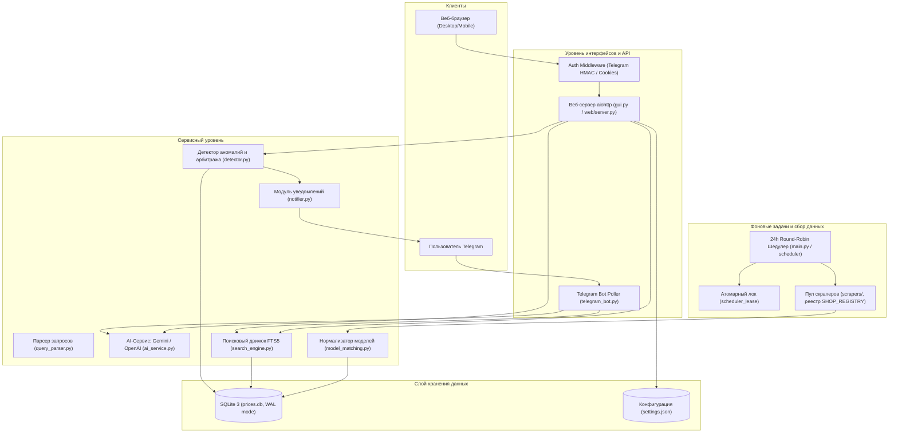

# 🏗 Архитектура системы KZ Price Hunter

## 1. Высокоуровневая диаграмма архитектуры

---

## 2. Поток данных (Data Pipeline)

1. **Сбор данных (Scraping)**:
   - Шедулер запускает адаптеры магазинов по расписанию через `asyncio.to_thread` (для синхронных) или нативные async-корутины.
   - Каждый адаптер возвращает структурированный `ScanResult` со списком элементов, удовлетворяющих `Scraper Protocol`.
   - Входные данные валидируются функцией `validate_product_item()`: отсекаются некорректные цены (`price <= 0`), пустые заголовки, невалидные URL.

2. **Сопоставление и сохранение (Matching & Ingestion)**:
   - Для каждого товара вычисляется детерминированный `canonical_key` через `model_matching.py`.
   - Проверяется защита от ложных совпадений аксессуаров (`is_junk_accessory`) и пересечений категорий.
   - Товар сохраняется в транзакции `insert_or_update_product`: обновляются текущая цена, история мин/макс цен, отметка доступности и timestamp `updated_at`.

3. **Детекция ценовых сбоев (Anomaly & Arbitrage Detection)**:
   - Детектор проверяет три типа аномалий:
     - **Ценовые ошибки («пропущенный ноль»)**: падение текущей цены в 8–12 раз относительно истории цен или зачеркнутой цены.
     - **Супер-скидки**: падение цены выше заданного процента и абсолютной выгоды (₸).
     - **Межмагазинный арбитраж**: сравнение цен между разными магазинами по единому `canonical_key`. При выявлении значительной ценовой вилки формируется кандидат на арбитраж.

4. **Доставка алертов (Notification Outbox)**:
   - Обнаруженные аномалии сохраняются в базе как кандидаты по мягким системным порогам.
   - Пользовательские фильтры (пороги скидок, минус-слова, выбранные магазины) применяются персонально при генерации уведомлений.
   - Отправка в Telegram выполняется через `notifier.py` с проверкой безопасности URL изображений.

---

## 3. Шедулер и 24-часовой цикл обновления

Для масштабирования до 100+ магазинов шедулер использует строгую архитектуру балансировки нагрузки:

- **24-часовой Round-Robin цикл**:
  - Все категории и магазины разбиты на волны.
  - Новый круг сканирования не начинается, пока не завершится текущий круг по всем источникам.
  - Все волны укладываются в 24-часовой интервал.

- **Приоритетные Hot-категории**:
  - Товары и категории с флагом `hot` (например, флагманские смартфоны или видеокарты) могут обновляться с повышенной частотой, не нарушая общую последовательность круга.

- **Атомарная координация процессов (`scheduler_lease`)**:
  - Блокировка задач выполняется на уровне SQLite с помощью транзакций `BEGIN IMMEDIATE` в таблице `scheduler_lease`.
  - Это предотвращает состояние гонки (race conditions) при одновременной работе фонового демона и ручных запросов из Web UI.
  - При запуске сервера вызывается `reset_stale_running_scans()`, переводящая зависшие статусы `running` (от аварийно завершившихся процессов) в `failed`.

- **Экспоненциальный Backoff**:
  - При сетевых сбоях или таймаутах магазина интервал повтора экспоненциально увеличивается от 300 с до 3600 с (таблица `shop_scans`), исключая перегрузку сбоящего сервиса.

---

## 4. Слой хранения (SQLite + WAL)

- **Режим WAL (Write-Ahead Logging)**:
  - База данных SQLite работает в режиме `journal_mode = WAL` с `synchronous = NORMAL` и `busy_timeout = 30000` (30 секунд).
  - Позволяет неограниченное параллельное чтение (поисковые запросы, веб-интерфейс, бот) без блокировки пишущими транзакциями скраперов.

- **Полнотекстовый поиск FTS5**:
  - Виртуальная таблица `products_fts` обеспечивает мгновенный поиск товаров с поддержкой стемминга, кириллических транслитераций и ранжирования по релевантности (`bm25`).

- **Миграции и безопасность данных**:
  - Версионирование схемы БД через таблицу `schema_metadata` (`schema_version`).
  - Перед выполнением любой миграции автоматически создается горячий снимок базы через SQLite Online Backup API в папку `data/backups/prices-pre-vN-<timestamp>.db` с проверкой целостности `quick_check`.
  - Каждая миграция выполняется в изолированной транзакции: при ошибке происходит автоматический откат и остановка стартапа без повреждения данных.
